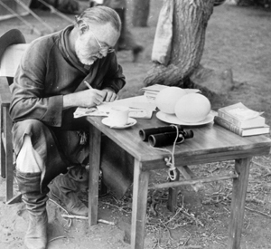

!SLIDE center
# Unhappy Code #
.notes From http://struts.apache.org/2.3.1.2/docs/struts-2-spring-2-jpa-ajax.html

!SLIDE bullets incremental
# Happy Code #

* Expressive
* Readable
* Concise

!SLIDE center

# Hemingway #

!SLIDE center
# Haiku #

An old silent pond...

A frog jumps into the pond,

splash! Silence again.

Basho (1644-1694) 